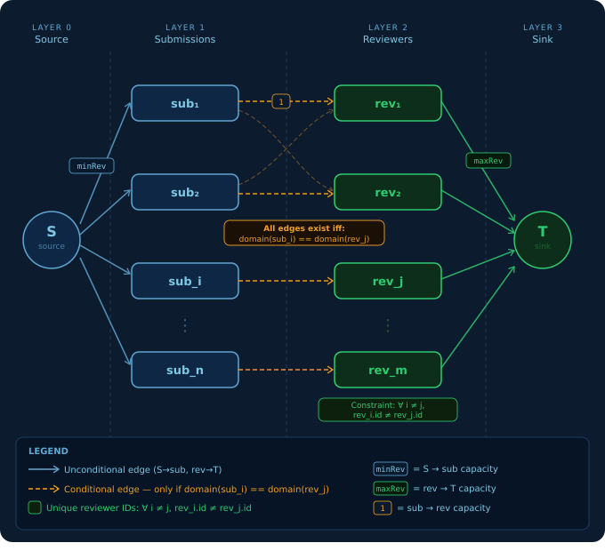

# Conference Review Assignment Tool

>This project was developed by <a href="https://github.com/T0m2sT">Pedro Tomás Teixeira</a> (up202404987), <a href="https://github.com/Pinho13">Rafael Pinho e Silva</a> (up202406334) for DA 2025/26.

**Design of Algorithms (DA) - L.EIC016**
Spring 2026 | Programming Project I

A command-line tool that assigns paper submissions to reviewers for scientific conferences using max-flow optimization. Given a set of submissions with topic domains and reviewers with areas of expertise, the tool computes an optimal review assignment that satisfies minimum review requirements while respecting reviewer workload limits.


## Build & Run

**Requirements:** C++17 compiler, CMake 3.17+

### Interactive Mode

```bash
./run.sh
```

Arrow-key menu with 9 options:
1. Load input file
2. Show submissions
3. Show reviewers
4. Show parameters & control settings
5. Check file errors
6. Export error report
7. Run assignment
8. Run all datasets
9. Exit

### Batch Mode

```bash
./run.sh -b dataset1 output
```


## Architecture

```
CSV Input --> CSVParser --> InputValidator --> Domain Models --> FlowNetwork (Dinic's) --> OutputWriter --> CSV Output
```

| Layer | Files | Purpose |
|-------|-------|---------|
| Data Models | `ConferenceData.h`, `AssignmentData.h` | Submission, Reviewer, Parameters, Control, AssignmentResult |
| Algorithm | `FlowNetwork.h/.cpp` | Max-flow via Dinic's algorithm on a 4-layer bipartite graph |
| Validation | `InputValidator.h/.cpp` | Field-level + cross-constraint validation |
| I/O | `CSVParser.h/.cpp`, `OutputWriter.h/.cpp` | Section-based CSV parsing and output generation |
| UI | `Menu.h/.cpp`, `DisplayFormatter.h/.cpp` | ANSI terminal UI with arrow-key navigation |
| Batch | `BatchProcessor.h/.cpp` | Run all datasets, collect summaries and error reports |
| Error Reporting | `ErrorReporting.h/.cpp` | Error report generation for individual and batch runs |
| Graph | `Graph.h` | **Professor-provided** — templated Vertex/Edge/Graph with flow support |

---

## Flow Network

The assignment problem is modeled as a 4-layer flow network:



### Domain Matching Modes

| Mode | Matching Rule | Edge Density |
|------|--------------|--------------|
| 1 | `sub.primary == rev.primary` | O(S*R/K) |
| 2 | Mode 1 + `sub.secondary == rev.primary` | O(2*S*R/K) |
| 3 | All primary/secondary combinations (4 checks) | O(S*R) |

---

## Algorithm: Dinic's Max-Flow

Chosen over Edmonds-Karp for its superior performance on unit-capacity bipartite graphs.

| Function | Purpose | Complexity |
|----------|---------|------------|
| `bfsLevel` | BFS to build layered graph (level assignment) | O(V + E) |
| `dfsSend` | DFS to find augmenting paths with current-edge pointer | O(E) total per phase |
| `dinic` | Outer loop: rebuild layers, find blocking flows | **O(E * sqrt(V))** |
| `buildAndSolve` | Graph construction + Dinic's | O(S*R * sqrt(S+R)) |
| `riskAnalysisK1` | Remove each reviewer, re-run max-flow | O(S*R^2 * sqrt(S+R)) |

**Why Dinic's over Edmonds-Karp:**
Edmonds-Karp finds one augmenting path per BFS pass at O(V*E^2). Dinic's finds a blocking flow per phase using current-edge pointers, achieving O(E*sqrt(V)) on unit-capacity bipartite networks.

> **Note:** On 3/14 datasets, Dinic's produces different (but equally valid) pairings compared to the datasets expected output (this also happened with our own implementation of Edmonds-Karp)


## Risk Analysis

### K = 1 (Implemented)

For each reviewer, remove them from the network and re-run Dinic's. If the assignment becomes infeasible, that reviewer is at-risk.

**Complexity:** O(R * E * sqrt(V))

### K > 1 (Outlined)

Determines if removing any K reviewers simultaneously would break the assignment.

**Approaches:**
- **Brute Force:** Test all C(R,K) subsets. O(C(R,K) * E * sqrt(V)). Feasible for small K.
- **Min-Cut Analysis:** The last failed BFS in Dinic's reveals the min-cut for free. Reviewers on the cut boundary form a critical set. O(E*sqrt(V)) for one critical set.
- **Iterative Deepening:** Build on K=1 at-risk set to find K=2 pairs. O(|A|*R*E*sqrt(V)) where |A| = K=1 at-risk set size.


## Input Validation

The `InputValidator` performs:
- **Field-level checks**: positive IDs, valid domains/expertise, mandatory fields
- **Format checks**: email must contain `@`, name must not (catches shifted CSV columns)
- **Duplicate detection**: via `unordered_set` for both submission and reviewer IDs
- **Cross-constraints**: total reviewer capacity vs required reviews, domain coverage per mode

---

## Project Structure

```
.
├── code
│   ├── CMakeLists.txt
│   ├── include
│   │   ├── BatchProcessor.h
│   │   ├── DisplayFormatter.h
│   │   ├── ErrorReporting.h
│   │   ├── FlowNetwork.h
│   │   ├── Graph.h
│   │   ├── Menu.h
│   │   ├── models
│   │   │   ├── AssignmentData.h
│   │   │   └── ConferenceData.h
│   │   ├── OutputWriter.h
│   │   └── parser
│   │       ├── CSVParser.h
│   │       └── InputValidator.h
│   └── src
│       ├── BatchProcessor.cpp
│       ├── CSVParser.cpp
│       ├── DisplayFormatter.cpp
│       ├── ErrorReporting.cpp
│       ├── FlowNetwork.cpp
│       ├── InputValidator.cpp
│       ├── main.cpp
│       ├── Menu.cpp
│       └── OutputWriter.cpp
├── dataset
│   ├── input/
│   ├── output/
│   └── risk/
├── description
│   └── ProjectDescription.pdf
├── docs
│   ├── Doxyfile
│   ├── html/
│   └── latex/
├── presentation
│   ├── max_flow_bipartite.png
│   └── ProjectPresentation.pdf
├── README.md
└── run.sh
```

## Output Format

```
#SubmissionId,ReviewerId,Match
31, 1, 3
87, 2, 1
#ReviewerId,SubmissionId,Match
1, 31, 3
2, 87, 1
#Total: 2
```

Unsuccessful assignments report missing reviews:
```
#SubmissionId,Domain,MissingReviews
31, 3, 2
```

Risk analysis output:
```
#Risk Analysis: 1
7, 8
```


### Self-Evaluation

| Name | Contribution |
| :---: | :---: |
| Pedro Tomás Teixeira | 50% |
| Rafael Pinho e Silva | 50% |